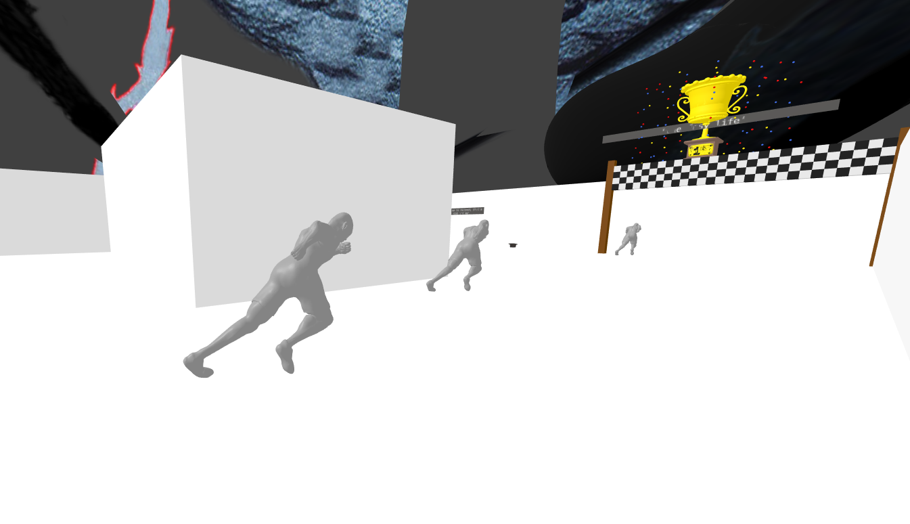

Hikikomori
------------

Initially, I was planning to use Unity3D and Mapbox SDK to create a location-based game. The goal of the game was to catch animals and "catch" information about resources that are 
available to students on campus - UBC has several peer-led initiatives (e.g. Wellness Peers) to help the personal, wellness and professional development of students on campus, so the intended audience 
were student leaders who would be receiving the leadership training in April or September. Although it was very different from what we had originally been working on in class,
with the help of a friend who had some experience in Unity, internet forms regarding Unity and this series of tutorials: https://www.mapbox.com/help-video/tutorials/unity-game-pocketdroids-go//. I was able to progress
through this challenge. For the most part, the tutorials were very informative and easy to follow, the only issues were debugging as it seems that C# has changed since the tutorials
were made in 2017 so certain functions needed to be refored. However after I had progressed to the 22 video out of 29 regarding the respawning, the 3D unity software had updated and my 
initial scripts that were used for the UI experience, etc. no longer worked. The issues was that there was .. "no MonoBehaviour in the Android Script" which was a part of the Mapbox SDK package.
As a result, the game was not finished in time for the lab's due date (however it will be a project to complete over the summer). This was a very unique expereince
as it has given me insight of how visualizations can influene can impact the ways that people interact with their space. Despite its challenges it was interesting to discover 
as I could create a narrative in deciding the spawning and guiding users to specfic areas on campus (e.g. the location of the Wellness Centre, a place where students can receive advice 
about various aspects of their health) and create that connection between their knowledge and the physical location. This led to the creation of the VR that will be discussed below.

My VR lab is an attempt to visualize and conceptualized the social phenomena,"hikikomori". The term hikokomori is a Japanses term used to refer to someone who has withdrawn from society. 
Many young people have holed up in their homes, some for decades; many hikikomori rely on their family for the basic neccessitiies of life. 
Although this is a phenomena that is occuring around the world, this particular issue is an issue in Japan as the birth rate is on the decline and the population grows older. Young people who
live as hikikomori will not have the resources or skills to support themselves in the event that their family grows older. In Japan, discussions regarding mental health can be
considered a taboo, and is not widely addressed by soceity. esearchers of this issue suggest that Japan's traditional cultural of conforming to society is the cause of this as 
the youth of today strive for individuality over conformity and feel as if they are failures if they fail to conform. This VR is an attempt to help build a bridge and better understand
the hikikomori that are living around the world today. I decided to take the thoughts of those who live as hikikomori and share their thoughts in a maze. 
For some it is a struggle to leave their homes due to a variety of personal reasons. I chose to create a maze as it would represent the thought process of humans and how 
one can become lost in their thoughts and can wander. The maze is colored white and which is quite jarring, when compared to the user's starting point - a bedroom
which gives a more welcoming feel. The color choice was as attempt to make the user uncomfortable with the maze which represents thoughts that hikikomoris have and their incomfort when
walking outside their comfort zones - their homes. Some of the thoughts and worries that these people have have been visualized in some way. One interesting feature about this VR would be the scene 
shown in the figure below. 

In many asian countries, youth face stress regarding their career choices, as the economy is less stable, the competition for these stable jobs
have increased and have placed tremendous pressure on education in these countries. One thing that I enjoyed about creating these scene in the maze is that the user can only move a one speed,
and can not move any faster than that. It feels as if this competition is a race to secure these positions and reflects feelings of some of these youth who are discouraged as their peers
continue to progress in their lives and they are stuck at home. 

However this VR is limited in its scope as it was done quickly in order to meet the deadline for the lab (the location-based game issue occured on Wednesday, 2 days before the lab was due). 
One of its limitations is the sparseness of content, I had issues with taking these stories of individuals and creating various scenes from them as this VR intended to have a more artistic 
interpretation of the issue. Additionally, the maze lacks physics, more specifically, users are still able to walk through features which makes it less realistic. If they wanted users, 
could walk straight to the exit and the obstables that block the exit (which disappear when you click on them).

Documentaries about Hikikomori:
https://www.bbc.com/news/magazine-23255526
https://www.bbc.com/news/magazine-23182523
https://www.youtube.com/watch?v=wE1UIK85E3E&t=2s
https://www.youtube.com/watch?v=oFgWy2ifX5s
https://www.nationalgeographic.com/photography/proof/2018/february/japan-hikikomori-isolation-society/
https://www.youtube.com/watch?v=HWY5hzcG_FY&t=8s
https://www.youtube.com/watch?v=ffvQZ2bGrRw&t=445s
https://www.abc.net.au/news/2015-07-07/hikikomori-japanese-men-locking-themselves-in-their-bedrooms/6601656

https://hikikomori.glitch.me/

